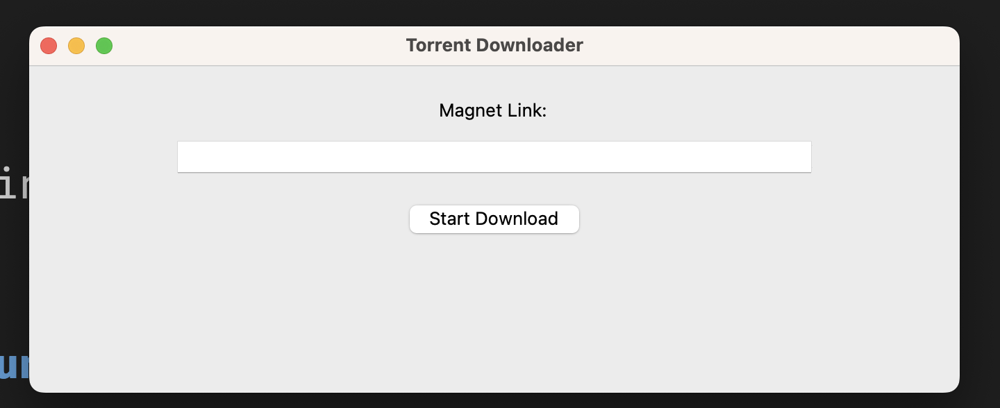

# GUI Torrent Downloader Python 3+

## Installation

```
python3 -m venv venv
```

Activate it

```
source venv/bin/activate
```

```
pip install -r requirements.txt
```

## Run it

```
python app.py
```



**Disclaimer: Torrent downloading is illegal in many countries and may violate copyright laws. This guide is intended for educational purposes only, and we do not condone or encourage any illegal activities.**

We strongly advise that you use this information solely for educational purposes and do not download any copyrighted materials without permission. Torrenting can pose significant legal risks, and we are not responsible for any consequences that may arise from using this information to engage in illegal activities. If you choose to download any copyrighted material, you do so at your own risk.

Please keep in mind that downloading copyrighted material without permission is a serious offense that can result in severe legal consequences, including fines and imprisonment. It is your responsibility to ensure that you are acting within the law and complying with all relevant regulations.

Remember, there are many legal and safe ways to obtain educational resources, including textbooks and academic papers, that do not involve torrenting or other illegal activities. We encourage you to explore these options and stay within the bounds of the law.
